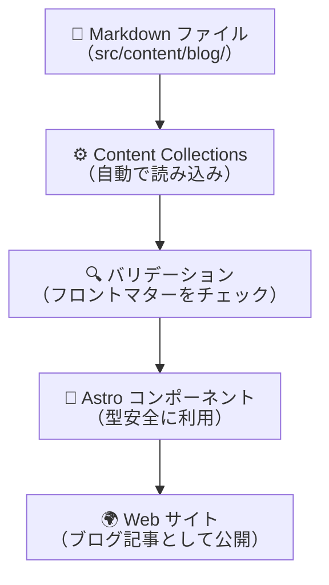
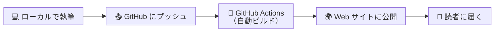

# Astroでブログを始める完全ガイド — フロントマッターとMarkdownの書き方

## この記事を読んでほしい人

- Astroでブログを始めたいが、どこから手をつけていいかわからない人
- フロントマッターの書き方を詳しく知りたい人
- Content Collectionsの仕組みに興味がある人
- 既にAstroの基本を理解しているが、記事の書き方を実践的に学びたい人

**前提知識**: [Astroの基本](/blog/astro-intro) をある程度理解していることを想定しています。Astro自体が初めての方は、まずそちらをお読みください。

---

## 目次

- [Content Collectionsとは？](#content-collectionsとは)
- [フロントマッターの完全ガイド](#フロントマッターの完全ガイド)
- [Markdownで記事を書く](#markdownで記事を書く)
- [プレビューから公開まで](#プレビューから公開まで)
- [まとめ](#まとめ)

---

## Content Collectionsとは？

AstroのContent Collectionsは、**ブログ記事のようなコンテンツを管理するための仕組み**です。

従来の静的サイトジェネレーターでは、記事を管理するための特別な設定が必要でしたが、AstroのContent Collectionsは **自動的に記事を認識し、型安全に扱える** ようになっています。

### 仕組みの全体像



### ファイル構造

ブログ記事は `src/content/blog/` フォルダに配置します。このフォルダ内のMarkdownファイルは、**自動的にContent Collectionsとして認識されます**。

```
src/
└── content/
    └── blog/
        ├── my-first-post.md
        ├── second-post.md
        └── another-post.md
```

### なぜContent Collectionsが便利なのか

| 特徴 | 従来の方法 | Content Collections |
|---|---|---|
| **記事の管理** | ファイルを手動で管理 | 自動で認識される |
| **型の安全性** | 型チェックが難しい | TypeScriptで型安全に扱える |
| **バリデーション** | 手動でチェックが必要 | 自動でバリデーションされる |
| **クエリ** | 手動でファイルを走査 | 簡単なクエリで取得できる |

---

## フロントマッターの完全ガイド

フロントマッターは、Markdownファイルの先頭にある `---` で囲まれた部分です。ここに記事の**メタデータ**を記述します。

### 基本構造

```markdown
---
title: "記事のタイトル"
description: "記事の簡単な説明文"
pubDate: 2026-08-06
tags: ["astro", "tutorial"]
draft: false
---

本文をここに書きます...
```

### 必須項目

フロントマッターで**必ず書かなければならない項目**は以下の3つです。

| 項目 | 説明 | 例 |
|---|---|---|
| `title` | 記事のタイトル（30文字以内がおすすめ） | `"Astroでブログを始める"` |
| `description` | 記事の簡単な説明文（120文字以内） | `"Astroの基本を解説します"` |
| `pubDate` | 公開日（YYYY-MM-DD形式） | `2026-08-06` |

> **⚠️ 注意**: `pubDate` は日付形式で記述する必要があります。間違った形式を指定すると、ビルド時にエラーが発生します。

### オプション項目

以下の項目は必須ではありませんが、**記事の品質を上げるために活用すると便利**です。

| 項目 | 説明 | 例 |
|---|---|---|
| `updatedDate` | 更新日（記事を更新した日） | `2026-08-10` |
| `heroImage` | ヒーロー画像（記事の冒頭に表示） | `../../assets/hero.png` |
| `tags` | タグ（記事の分類） | `["astro", "tutorial"]` |
| `draft` | 下書きフラグ（trueで非公開） | `false` |
| `collection` | コレクション名（記事のグループ分け） | `"tutorials"` |
| `collectionDescription` | コレクションの説明文 | `"チュートリアル記事"` |
| `enableComments` | コメント機能の有効化 | `true` |

### 実践的なフロントマターの例

実際のブログ記事でよく使うフロントマターを具体例で紹介します。

#### 基本的な記事

```markdown
---
title: "JavaScriptの配列を操作する10の方法"
description: "配列の扱いに苦労している方に向けて、よく使う操作を10個紹介します。"
pubDate: 2026-08-06
tags: ["javascript", "tutorial"]
draft: false
---
```

#### ヒーロー画像付きの記事

```markdown
---
title: "Reactアプリをゼロから作る"
description: "Reactの基礎からアプリケーション完成までを解説します。"
pubDate: 2026-08-06
heroImage: "../../assets/react-hero.png"
tags: ["react", "javascript"]
draft: false
---
```

#### 下書き状態の記事

```markdown
---
title: "Next.jsの新機能まとめ"
description: "Next.jsの最新機能を紹介します。"
pubDate: 2026-08-06
tags: ["nextjs", "react"]
draft: true
---
```

> **💡 ヒント**: `draft: true` にすると、その記事はブログ一覧に表示されず、プレビューでのみ確認できます。記事を書き途中で公開したくない場合に便利です。

### 日付の記述方法

`pubDate` と `updatedDate` は、以下の形式で記述できます。

| 形式 | 例 | 説明 |
|---|---|---|
| YYYY-MM-DD | `2026-08-06` | 最もシンプルな形式 |
| YYYY-MM-DDTHH:mm | `2026-08-06T10:30` | 時間も指定可能 |

---

## Markdownで記事を書く

フロントマターの下には、Markdown形式で本文を記述します。Markdownは、**見出し、段落、リスト、コード**などを簡単に記述できる軽量マークアップ言語です。

### 基本的な書き方

#### 見出し

Markdownでは `#` を使って見出しを記述します。数が増えるほど、見出しのレベルが下がります。

```markdown
# 記事のタイトル（H1）

## セクション（H2）

### サブセクション（H3）
```

> **📝 注意**: H1（`#`）は記事タイトルとして1つのみ使用してください。複数のH1があると、SEO上有害です。

#### 段落と強調

```markdown
これは普通の段落です。

**太字のテキスト**

*斜体のテキスト*

***太字＋斜体***
```

#### リスト

```markdown
- 箇条書き1
- 箇条書き2
  - ネストされた項目

1. 番号付きリスト1
2. 番号付きリスト2
```

#### コード

```markdown
`インラインコード` は短いコードに使います。

```javascript
// コードブロックは3つのバッククォートで囲みます
const greeting = "こんにちは";
console.log(greeting);
```
```

#### リンクと画像

```markdown
[リンクテキスト](https://example.com)


```

### Mermaid ダイアグラムの挿入

Astroのブログ記事では、**Mermaid** を使ってフローや概念を図式化できます。

````markdown

````


### テーブルの作成

```markdown
| 列1 | 列2 | 列3 |
|---|---|---|
| 値1 | 値2 | 値3 |
| 値4 | 値5 | 値6 |
```

| フロントマッター | 必須 | 説明 |
|---|---|---|
| title | ✅ | 記事のタイトル |
| description | ✅ | 記事の説明文 |
| pubDate | ✅ | 公開日 |
| tags | ❌ | タグ |
| draft | ❌ | 下書きフラグ |

---

## プレビューから公開まで

記事を書いたら、次のステップはプレビューで確認し、公開することです。

### ステップ1: プレビューで確認する

ローカル環境で以下のコマンドを実行します。

```bash
npm run dev
```

ブラウザで `http://localhost:4321` を開くと、**現在の記事がどのように表示されるか** を確認できます。

> **💡 ヒント**: ファイルを保存すると、ブラウザが自動で更新されます。「書いて→確認して→直す」を素早く繰り返せます。

### ステップ2: 記事を追加・編集する

`src/content/blog/` に新しいMarkdownファイルを追加するだけで、記事が自動的にブログ一覧に反映されます。

```
src/content/blog/
├── astro-intro.md          ← 既存の記事
├── my-new-post.md          ← 新しい記事
└── another-article.md      ← 別の記事
```

**新しいファイルを追加するだけで、一覧ページに載るし、タグで分類もされるし、RSSフィードにも反映されます。**

### ステップ3: 公開する

記事の準備が整ったら、GitHubにプッシュします。

```bash
git add src/content/blog/my-new-post.md
git commit -m "Add new blog post: my-new-post"
git push
```

プッシュすると、**GitHub Actionsが自動でビルドとデプロイを行います**。手動でサーバーにログインする必要はありません。

### ステップ4: 公開を確認する

数分後に、公開されたサイトで記事が表示されているか確認します。



### 公開フローのまとめ

| ステップ | 内容 | 所要時間 |
|---|---|---|
| 1. プレビュー | ローカルで確認 | 〜1分 |
| 2. 記事の追加 | Markdownファイルを配置 | 〜5分 |
| 3. プッシュ | GitHubにアップロード | 〜1分 |
| 4. ビルド | GitHub Actionsが実行 | 〜2-5分 |
| 5. 公開確認 | サイトで確認 | 〜1分 |

**合計: 10分程度で記事を公開できます。**

---

## まとめ

この記事では、Astroでブログを始めるための**必須知識**をまとめました。

### 覚えておくこと

1. **Content Collections** が自動で記事を管理してくれる
2. **フロントマッター** は `title`, `description`, `pubDate` の3つが必須
3. **Markdown** で簡単に記事が書ける
4. **プレビュー** で確認してから公開するのがおすすめ
5. **GitHubにプッシュ** するだけで自動で公開される

### 次のステップ

- [Astroの基本をもっと学ぶ](/blog/astro-intro)
- [GitHub Pagesでサイトを公開する](/blog/github-pages-intro)

Astroは、ブログを始めるための素晴らしいツールです。この記事が、あなたのブログ開設の一助になれば幸いです。
