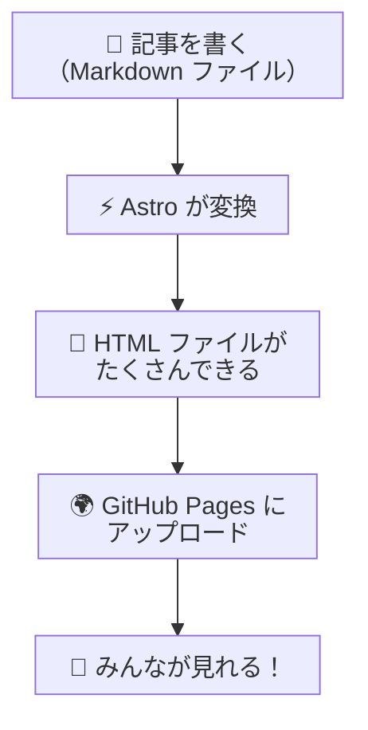
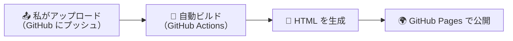

# このブログはどうやって作ったの？— Astro でサイトを作るお話

## この記事を読んでほしい人

- 「Web サイトってどうやって作るの？」と思っている人
- 「プログラミングって難しそう…」と感じている人
- 「このブログ、かっこいいけど何を使っているの？」と気になった人

難しい用語はできるだけやさしく説明するので安心してくださいね。

## 目次

- [まず最初に：Web サイトの基本のお話](#まず最初にweb-サイトの基本のお話)
- [Astro って何？](#astro-って何)
- [Astro を使うと何がいいの？](#astro-を使うと何がいいの)
- [このブログはどうやって動いているの？](#このブログはどうやって動いているの)
- [どんなファイルがあるの？](#どんなファイルがあるの)
- [ブログ記事を書くには？](#ブログ記事を書くには)
- [インターネットに公開するには？](#インターネットに公開するには)
- [まとめ](#まとめ)

---

## まず最初に：Web サイトの基本のお話

### Web サイトは「材料」を「調理」してできている

Web サイトを見るとき、みなさんのブラウザ（Chrome や Edge など）は **HTML** というファイルを読んで画面に表示しています。

**HTML** とは「見出し」「段落」「画像」などを書くための**メモ帳のようなもの**だと思ってください。

```html
<h1>こんにちは！</h1>
<p>これは私のホームページです。</p>
```

こんなメモをブラウザが読み取って、「ああ、見出しと文章があるんだな」と解釈して画面に表示してくれるわけです。

### ブログをたくさん書くときの問題

でも、ここで一つ困ったことがあります。

ブログのように**たくさんの記事**を書くサイトの場合、全部のページを手で HTML に書いていたら大変です。

- 記事を増やすたびに「一覧ページ」も書き換えないといけない
- どのページにも共通する「ヘッダー」（サイトのタイトル部分など）を毎回コピペする
- ブログの見た目を少し変えようと思ったら、全ページを修正する羽目になる

そこで登場するのが **Astro** です。

---

## Astro って何？

**Astro**（アストロ）は、**Web サイトを作るための道具セット**（フレームワーク）です。

「材料（Markdown ファイルなど）」を放り込むと、**自動で Web サイトに調理してくれる料理人のような存在**です。


### ちょっとした例え

Astro をわかりやすく例えると：

| 道具 | 何をするもの？ | Astro でいうと… |
|---|---|---|
| **包丁とまな板** | 料理の下ごしらえ | **Markdown**（記事を書く形式） |
| **料理人** | 材料を料理に仕上げる | **Astro**（自動で変換してくれる） |
| **出来上がった料理** | 食べるもの | **HTML ファイル**（ブラウザで見れる完成品） |

つまり、**簡単なメモ書き（Markdown）を用意するだけで、立派な Web サイトに仕上げてくれる料理人のようなもの**、それが Astro です。

---

## Astro を使うと何がいいの？

### いいところ①：普通のメモ書きで記事が書ける

このブログの記事は、すべて **Markdown（マークダウン）** という形式で書かれています。

Markdown は、こういう書き方をするものです：

```markdown
# これは見出しです

これは**太字**の文章です。

- 箇条書き
- 箇条書き


```

とてもシンプルですよね？ **Word や Google ドキュメントの代わりに、メモ帳で書けるくらい簡単な形式** なんです。

### いいところ②：でき上がる Web サイトがとにかく速い

Astro が作る Web サイトは、**でき上がりが純粋な HTML** だけです。

「なんで速いの？」と思うかもしれません。世の中には「表示するたびにその場でページを作る」タイプのサイトもありますが、Astro は**前もって全部のページを作り終えた状態**で公開します。なので、みなさんがアクセスしたときは「でき上がった料理を出すだけ」の状態。とても速いんです。

### いいところ③：間違いを指摘してくれる

このブログの記事には、それぞれ「タイトル」「公開日」「タグ」などの情報（フロントマターと言います）が付いています。

```markdown
---
title: "記事のタイトル"
pubDate: 2026-07-29
tags: ["astro"]
---
```

Astro は、「公開日なのに日付じゃない変な文字が入ってるよ！」とか「必須のタイトルが書いてないよ！」と**自動でチェックして間違いを教えてくれます**。これで「公開した後に気づいた…」という悲しいミスを減らせます。

### いいところ④：テンプレート（型紙）がたくさんある

ここからは少しだけ専門的な話になりますが、Astro の魅力をもう一つ。

「Web サイトを一から作るのは難しそう…」と思うかもしれません。でも大丈夫。Astro には **テーマ（テンプレート）** と呼ばれる**誰かが作ってくれた「お手本のサイト」** がたくさん公開されています。

#### テーマって何？

テーマは、服で例えると **型紙** のようなものです。

| | 服の場合 | Web サイトの場合 |
|---|---|---|
| **一から作る** | 布を切って縫って…大変 | HTML も CSS も全部自分で書く…大変 |
| **型紙（テーマ）を使う** | 型紙に沿って切って縫うだけ | **テーマを元に、記事を書くだけ** |

このブログも、**LogFlow Theme** というテーマをベースにして作られています。テーマが用意してくれた「デザイン」や「ブログの仕組み」をそのまま使って、記事を書くことに集中できるようになっています。

いろんなテーマが [Astro の公式サイトのテーマ一覧](https://astro.build/themes/) にギャラリー形式でまとめられています。

> **⚠️ 注意**: テーマには **無料のものと有料のもの** があります。気に入ったテーマがあれば、ダウンロードする前に価格を確認しましょう。もちろん、このブログで使っている LogFlow Theme は無料で利用できます。

#### テーマを使うとなにが嬉しいの？

- **プロ並みのデザインが最初から使える**
- **「ブログの仕組み」はすでに出来上がっている** — あとは記事を書くだけ
- **色やフォントは後から自由にカスタマイズできる** — 自分の好みにアレンジ可能

---

## このブログはどうやって動いているの？

このブログができるまでの流れをざっくり絵にすると、こんな感じです：



1. **記事を書く** — この記事も Markdown という形式で書いています
2. **Astro が変換する** — `astro build` というコマンドを実行すると、Markdown が HTML に変わります
3. **できた HTML をアップロードする** — GitHub Pages という無料の公開サービスに置きます
4. **みんなが見られるようになる** — あなたが今見ているこの画面がそうです

### 余談：料理で例えると

1. **食材を切る（記事を書く）** ← 今ここ
2. **料理人が調理する（Astro が変換する）**
3. **お皿に盛り付ける（HTML ができる）**
4. **テーブルに並べる（インターネットに公開する）**
5. **お客さんが食べる（みんなが見る）**

こんな流れです。「お客さんが来るたびに一から料理する」のではなく、「**事前に全部作り終えて並べてある**」ので、アクセスが速いんです。

---

## どんなファイルがあるの？

さっき「LogFlow Theme というテーマを使っている」と言いましたが、テーマをインストールすると、以下のようなフォルダ構成が最初から用意されています。**まるで、ゲームのプロジェクトテンプレートを開いたときのように、最初からいろんなフォルダが準備されている**イメージです。

```
src/
├── content/blog/   ← ここに記事（Markdown ファイル）を入れる
├── components/     ← ボタンやカードなど、パーツ類
├── layouts/        ← ページの「型」（レイアウト）
├── pages/          ← トップページや「このサイトについて」など
└── styles/         ← 色や文字の大きさなどのデザイン設定
```

### content/blog/ — 記事を入れる場所

この `content/blog/` というフォルダに Markdown ファイルを入れると、**自動的にブログ記事として認識されます**。

新しいファイルを一つ追加するだけで、一覧ページにも載るし、タグで分類もされるし、RSS フィード（新着記事をお知らせする仕組み）にも反映されます。**「ファイルを追加する」だけで全部やってくれる**、とても便利な仕組みです。

### layouts/ — ページの「型」

ブログの記事を開いたとき、「どのページも同じようなレイアウト（配置）だな」と感じたことはありませんか？

タイトルが上にあって、日付が書いてあって、本文がある…。この「型」を **BlogPost.astro** というファイルで一度だけ作っておけば、**全記事が自動的にその型にはまります**。デザインを変えたくなったら、このファイルを直すだけで全記事の見た目が変わります。

---

## ブログ記事を書くには？

実際に、新しい記事を書く手順を見てみましょう。

### Step 1：ファイルを作る

`src/content/blog/` の中に、新しい Markdown ファイルを作ります。ファイル名は、例えば `hello-world.md` のようにします。

### Step 2：情報を書く（フロントマター）

ファイルの先頭に `---` で囲んだ部分を書きます。ここに記事の情報を入れます。

```markdown
---
title: "はじめてのブログ記事"
description: "この記事の簡単な紹介文"
pubDate: 2026-07-29
tags: ["日記"]
draft: false
---
```

| 項目 | 意味 | 例 |
|---|---|---|
| `title` | 記事のタイトル | 「はじめてのブログ記事」 |
| `description` | 記事の簡単な説明 | 「この記事の簡単な紹介文」 |
| `pubDate` | 公開する日付 | 2026-07-29 |
| `tags` | 記事の分類タグ | 「日記」「料理」など |
| `draft` | 下書きかどうか | `true` にすると非公開 |

### Step 3：本文を書く

フロントマターの下に、普通の文章を書いていきます。

```markdown
---
title: "はじめてのブログ記事"
pubDate: 2026-07-29
---

今日からブログを始めました。

## 好きなこと

- 読書
- 散歩
- カフェ巡り

よろしくお願いします！
```

これだけでブログ記事の完成です。**特別なソフトも必要ありません**。メモ帳でも書けます。

### Step 4：プレビューで確認する

パソコンで `npm run dev` というコマンドを実行すると、**書いた記事が実際にどんな見た目になるか**をブラウザで確認できます。ファイルを保存すると、自動で画面が更新されるので、「書いて→確認して→直す」をすぐに繰り返せます。

### Step 5：公開する

記事に満足したら、GitHub にアップロード（プッシュ）します。すると、あとは自動で Web サイトが更新されます（次の章で詳しく説明します）。

---

## インターネットに公開するには？

せっかく作ったブログも、インターネットに公開しなければ誰も見られません。

このブログでは **GitHub Pages** という**無料の公開サービス**を使っています。

### 公開の流れ



難しい操作は必要ありません。**GitHub にファイルをアップロードするだけで、あとは全部自動でやってくれます。**

具体的にはこんな流れです：

1. 私が記事を書き終える
2. GitHub にアップロードする（`git push` という操作）
3. それを検知して **GitHub Actions**（自動実行くん）が起動する
4. GitHub Actions が `astro build` を実行して HTML を生成する
5. できた HTML を **GitHub Pages** が自動で公開する
6. あなたが今、この記事を読んでいる 📖

全部で **1〜2分** ほどで完了します。「ポチッ」としたら、あとはコーヒーを飲んで待つだけです。

---

## まとめ

このブログがどうやってできているか、なんとなくイメージできましたか？

- ✅ **Astro** は、簡単なメモ書き（Markdown）を Web サイトに変換してくれる「ゲームエンジン」のような道具
- ✅ **テーマ（テンプレート）** を使えば、デザインや仕組みを一から作らなくて済む
- ✅ でき上がる Web サイトは **超高速** に表示される
- ✅ 記事は **Markdown** というシンプルな形式で書ける
- ✅ **GitHub Pages** を使えば **無料** で公開できる
- ✅ 公開の手順も **自動化** されていて、アップロードするだけ

「Web サイト作ってみたいな」と思ったら、Astro はとてもやさしい選択肢です。

公式サイトの[日本語のチュートリアル（入門ガイド）](https://docs.astro.build/ja/getting-started/)もとても丁寧なので、興味が湧いたら覗いてみてください。

このブログのソースコードも [GitHub で公開](https://github.com/DMARU9/DMARU9.github.io) しています。「実際のファイル構成ってこんな感じなんだ」と眺めてみるのも楽しいですよ。
