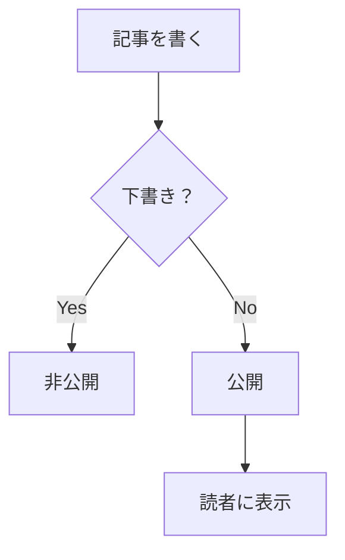
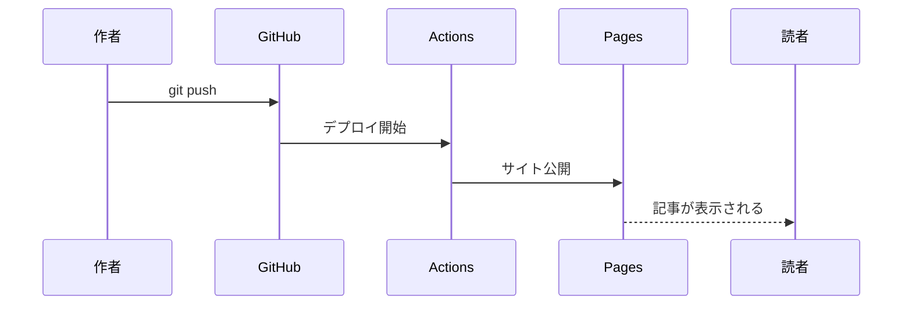
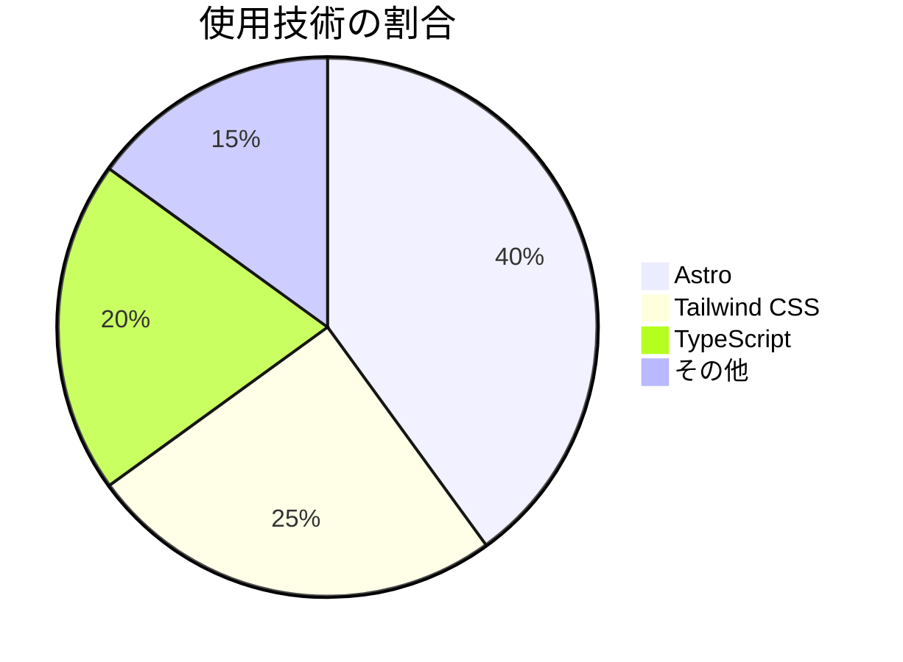

# Mermaid 図のテスト

この記事では Mermaid 記法で図が描画されることを確認します。

## フローチャート

```mermaid
flowchart TD
  A[記事を書く] --> B{下書き？}
  B -->|Yes| C[非公開]
  B -->|No| D[公開]
  D --> E[読者に表示]
```

## シーケンス図

```mermaid
sequenceDiagram
  作者->>GitHub: git push
  GitHub->>Actions: デプロイ開始
  Actions->>Pages: サイト公開
  Pages-->>読者: 記事が表示される
```

## 円グラフ

```mermaid
pie title 使用技術の割合
  "Astro" : 40
  "Tailwind CSS" : 25
  "TypeScript" : 20
  "その他" : 15
```
