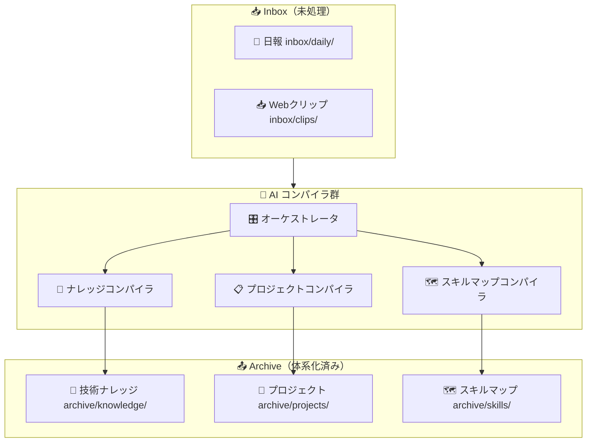
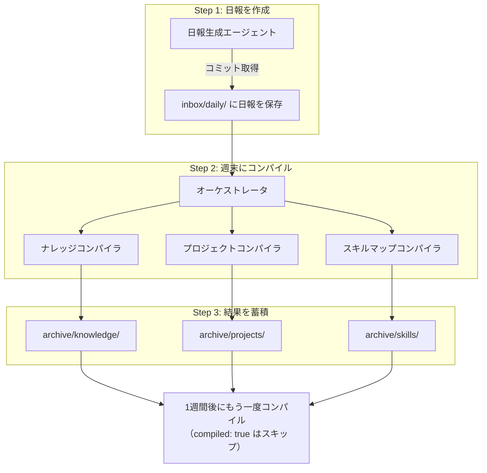
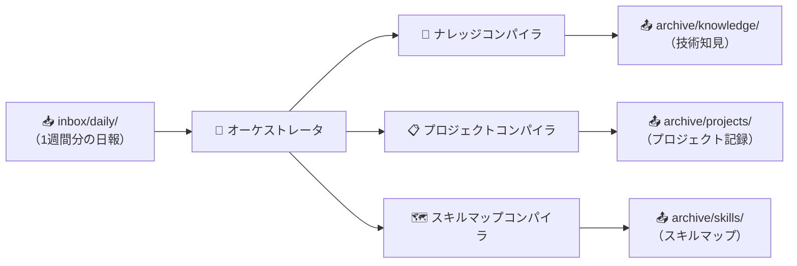
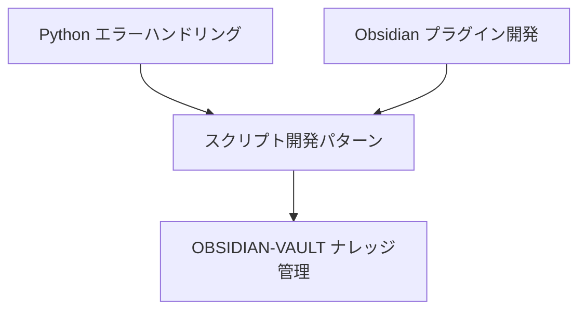

# Obsidian でナレッジ管理基盤を構築する — AI エージェントと Inbox → Archive モデル

## この記事を読んでほしい人

- 「Obsidian でナレッジ管理を始めたいけど、どう整理すればいいかわからない」と感じている人
- 「日報やメモを書いているけど、蓄積した情報が活用できていない」と感じている人
- 「AI を使って情報の自動整理・体系化をしたい」と思っている人
- 「自分の開発活動をもっと可視化・アウトプットしたい」と思っている人

---

## 目次

- [なぜ Obsidian でナレッジ管理を始めたのか](#なぜ-obsidian-でナレッジ管理を始めたのか)
- [設計思想：Inbox → Archive コンパイルモデル](#設計思想inbox--archive-コンパイルモデル)
- [フォルダ構成の考え方](#フォルダ構成の考え方)
- [AI エージェントで情報を自動整理する](#ai-エージェントで情報を自動整理する)
- [実際のフロー：日報作成からコンパイルまで](#実際のフロー日報作成からコンパイルまで)
- [同じようなものを構築するためのステップ](#同じようなものを構築するためのステップ)
- [まとめ](#まとめ)

---

## なぜ Obsidian でナレッジ管理を始めたのか

### 情報の「あるある」

開発をしていると、こんな経験はありませんか？

- 作った技術メモが散在して、必要なときに見つからない
- 日報を書いてはいるが、後から読み返すことがほとんどない
- Web で良い記事を見つけたが、保存しておいて中身を読んでいない
- プロジェクトで得た知見が、次のプロジェクトで活かせない

これらはすべて「**情報があるのに、活用できていない**」という典型的な問題です。

### Obsidian を選んだ理由

- **マークダウンファイルとして保存される**: データが閉じ込められない
- **リンクでノートを繋げる**: 知識の関係性を自然に表現できる
- **プラグインが豊富**: 自分のワークフローに合わせてカスタマイズできる
- **Git と相性が良い**: バージョン管理がしやすい

---

## 設計思想：Inbox → Archive コンパイルモデル

一番重要な設計思想は「**Inbox → Archive コンパイルモデル**」です。

```
📥 Inbox（未処理）→ 🤖 AI コンパイラ → 📤 Archive（体系化済み）
```

### 具体的な流れ



### なぜこの設計なのか

1. **日報は「生の情報」としてinboxに入れる**: 完璧に書く必要がない
2. **AI が定期的にコンパイル**: 人間が手動で整理する手間を削減
3. **Archive には体系化された情報だけが入る**: いつでも信頼できる情報が参照できる

### 「積み上げる」ための設計

単に情報を整理するだけでなく、**日を追うごとに自分の知識が育っていく**ことを意識しました。

- **ナレッジ**: 技術的な知見をカテゴリ別に蓄積。日報に書いた学びが、やがて体系的なナレッジになる
- **スキルマップ**: 自分のスキルを可視化し、どの分野に強みがあるか・弱みがあるかを一目で把握する

ナレッジだけだと「何を知っているか」はわかりますが、「**どんなことを実践できるか**」までは見えません。スキルマップを追加することで、知見と実践の両面から自分の成長を追跡できるようにしています。

---

## フォルダ構成の考え方

### 全体構成

```
/
├── inbox/                        # 📥 未処理の情報源
│   ├── daily/                    #   日報（デイリーノート）
│   ├── clips/                    #   Webクリップ・クイックキャプチャ
│   └── attachments/              #   画像などの添付ファイル
├── archive/                      # 📤 コンパイル済み
│   ├── weekly/                   #   週報（週次サマリー）
│   ├── knowledge/                #   体系化された技術ナレッジ
│   ├── projects/                 #   プロジェクト単位の情報
│   └── skills/                   #   スキルマップ
├── system/                       # ⚙️ システムファイル
│   ├── templates/                #   テンプレート群
│   └── schema/                   #   メタデータスキーマ定義
└── .github/                      # 🤖 AIエージェント・自動化設定
    ├── agents/                   #   コンパイラエージェント定義
    ├── prompts/                  #   エージェント用プロンプト
    └── scripts/                  #   自動化スクリプト群
```

### 各ディレクトリの設計意図

| ディレクトリ | 役割 | 使い方 |
|-------------|------|--------|
| `inbox/daily/` | 日報の蓄積 | 毎日のデイリーノートをここに書く |
| `inbox/clips/` | Web記事のクイック保存 | Chrome拡張などでクイック保存 |
| `archive/knowledge/` | 体系化された技術知見 | AIがコンパイルして生成 |
| `archive/projects/` | プロジェクト単位の記録 | プロジェクトの成果物・学びを管理 |
| `archive/skills/` | スキルの可視化 | 自分のスキル体系をマッピング |
| `system/templates/` | テンプレート一元管理 | 品質と統一性を担保 |

---

## AI エージェントで情報を自動整理する

### 作成したエージェント群

この Vault では、情報を自動で整理・体系化するために **5つの AI エージェント** を活用しています。

| エージェント | 役割 | 入力 → 出力 |
|-------------|------|------------|
| **日報生成** | Gitコミット取得 → 日報自動生成 | コミット履歴 → `inbox/daily/` |
| **ナレッジコンパイラ** | 技術ナレッジの抽出・体系化 | `inbox/` → `archive/knowledge/` |
| **プロジェクトコンパイラ** | プロジェクト進捗・タスク管理 | `inbox/` → `archive/projects/` |
| **スキルマップコンパイラ** | スキル情報の抽出・マップ化 | `inbox/` → `archive/skills/` |
| **オーケストレータ** | 全コンパイラの統括・一括実行 | 全体をまとめて実行 |

### エージェントの使い方（概念）

VS Code の **Copilot Chat や類似の AI 拡張機能** を使用し、定義したエージェント（プロンプトやスクリプト）を実行します。

```
# 全体コンパイル
all

# ナレッジのみ
knowledge

# プロジェクトのみ
projects
```

> **補足**: 上記のコマンドは、Obsidian の標準コマンドではなく、私が作成した AI エージェントを実行するための**独自の呼び出しキーワード**です。

### コンパイルの仕組み

ここでの設計で一番こだわったのは、「**AI に全部任せるのではなく、適材適所で処理を分担する**」ことです。

各コンパイラには Python スクリプトが附属しており、以下のような役割分担になっています（**すべて私が作成したスクリプトや AI プロンプトによる実装**です）。

| 処理 | 担当 | 理由 |
|------|------|------|
| ファイルの検出・読み取り | **スクリプト** | 決定的な処理なので高速・確実 |
| `compiled: true` のフラグ管理 | **スクリプト** | 書式が決まっているので自動化 |
| 内容の分析・ナレッジ抽出 | **AI** | 文脈理解が必要なので AI が適している |
| ナレッジノートの生成 | **AI** | 自然な文章生成は AI の得意分野 |

スクリプトが「**ファイルの検出 → 読み取り → AI に渡す → 結果を保存 → フラグを付与**」という一連の流れを制御し、AI は「**与えられた内容を分析し、有用な情報を抽出する**」ことに集中します。

この設計により、以下のメリットがあります。

- **処理が高速**: ファイル操作はスクリプトが行うため、AI の応答を待つ必要がない
- **コスト削減**: 決定的な処理に AI を使わないので、トークン消費を抑える
- **再現性**: スクリプト部分は常に同じ結果を返すので、不具合が起きにくい

---

## 実際のフロー：日報作成からコンパイルまで

ここでは、実際に毎日どういう流れで情報を扱っているかを具体例で説明します。

### 全体の流れ



### Step 1: 日報を作成する

VS Code のエージェントセレクターから「**日報生成**」を選択し、チャットに以下のように入力します。

```
今日の日報を生成して
```

エージェントは自動で GitHub リポジトリのコミット履歴を取得し、以下のような日報の下書きを提示してくれます。

```markdown
---
title: "2026-08-03"
tags: [daily]
created: 2026-08-03
compiled: false
---

# 2026-08-03 の日報

## 実施内容
- OBSIDIAN-VAULT: ナレッジコンパイラのリファクタリング
- DMARU9.github.io: ブログ記事の執筆

## 学び
- Python スクリプトのエラーハンドリングパターンを整理
```

エージェントの問いかけに答えながら振り返りを追加すると、完成した日報が `inbox/daily/2026-08-03.md` に自動保存されます。

### Step 2: 週末にオーケストレータを実行する

1週間分の日報が溜まったら、オーケストレーターエージェントを起動します。

```
all
```

これで以下の3つのコンパイラが順番に実行されます。



### Step 3: ナレッジコンパイラが日報から知見を抽出する

ナレッジコンパイラは、日報の「学び」セクションに記録された内容を分析します。

例えば、先ほどの日報の「Python スクリプトのエラーハンドリングパターンを整理」という学びがあれば、以下のようなナレッジノートを生成します。

```markdown
---
title: "Python スクリプトのエラーハンドリングパターン"
tags: [knowledge, python]
created: 2026-08-03
status: seedling
compiled: true
---

# Python スクリプトのエラーハンドリングパターン

## 概要
- Python スクリプトで発生しやすいエラーとその対処法を整理

## 実践内容
- OBSIDIAN-VAULT のコンパイラスクリプト開発で検証

## 参考元
- inbox/daily/2026-08-03.md
```

### Step 4: コンパイル済みフラグで重複を防ぐ

コンパイルが完了した日報には `compiled: true` が設定されます。次回オーケストレーターを実行したとき、スクリプトがこのフラグをチェックし、フラグがついたファイルは自動的にスキップされるため、同じ内容が二重に処理されることはありません。

```
inbox/daily/
├── 2026-08-01.md   # compiled: true  ← スキップ
├── 2026-08-02.md   # compiled: true  ← スキップ
└── 2026-08-03.md   # compiled: false ← 処理対象
```

### Step 5: ナレッジが蓄積されていく

日を追うごとに、`archive/knowledge/` に技術ナレッジが蓄積されていきます。やがて複数のナレッジが関連付けられ、自分の知識体系が形作られていくのが見えるはずです。



---

## 同じようなものを構築するためのステップ

実際に、同等のナレッジ管理基盤を構築したい方に向けて、ステップをまとめます。

### Step 1: フォルダ構成を決める

まず、**Inbox と Archive を分ける**という基本方針を決めます。

- `inbox/daily/` に毎日の日報を書く
- `archive/knowledge/` に技術ナレッジを蓄積する

### Step 2: テンプレートを作る

日報・ナレッジ・プロジェクトごとにテンプレートを作ります。フロントmatter のスキーマを最初に定義しておくと、後から楽になります。

### Step 3: タグ体系を設計する

ノートの種別を区別するためのタグと、成熟度を表すタグを設計します。

### Step 4: AI エージェントを導入する

VS Code のカスタムエージェント機能や、CI/CD ツールを活用して、以下の自動化を実現します。

- **日報の自動生成**: Git コミット履歴から日報を作成
- **コンパイラ**: inbox の情報を体系化されたナレッジに変換

### Step 5: 運用と改善

実際に運用しながら、テンプレートやタグ体系を改善していきます。最初から完璧を目指す必要はありません。

---

## まとめ

Obsidian を使ったナレッジ管理では、以下の3点が重要です。

1. **Inbox → Archive の明確な分離**: 未処理と処理済みを分けることで、情報の流れが見える
2. **AI エージェントによる自動コンパイル**: 人間が手動で整理する手間を削減
3. **テンプレートとスキーマによる品質管理**: ノートの統一性と信頼性を担保

「書くこと」は苦労しますが、**「書いたものを活かす仕組み」** を作ることで、ナレッジは資産になります。

まずは日報を1日1つ書くことから始めてみてはいかがでしょうか。
