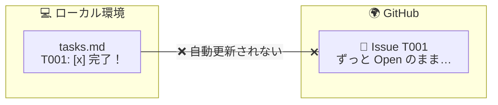
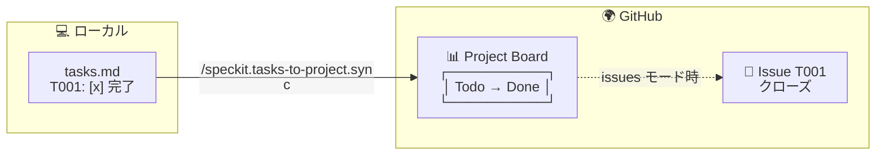

# spec-kit をもっと便利に — コミュニティ拡張機能と GitHub 連携の深掘り

## この記事を読んでほしい人

- 既に spec-kit の基本的な使い方（`/speckit.specify` → `/speckit.tasks` → `/speckit.implement` の流れ）を知っている人
- `/speckit.taskstoissues` を使って GitHub Issues にタスクを投稿したことがある人
- 「Issue を作ったけど、完了したときに自動で閉じてくれないのが不便」と感じている人
- spec-kit をチーム開発で本格的に使いたいと考えている人

> 前提知識として、[spec-kit で仕様をコードに変える](/blog/spec-kit-intro) で紹介した基本的なワークフローを把握していることを想定しています。

---

## 目次

- [注意点：Issue の更新は自動では行われない](#注意点issue-の更新は自動では行われない)
- [拡張機能でさらに便利に](#拡張機能でさらに便利に)
- [Tasks to GitHub Project で実現すること](#tasks-to-github-project-で実現すること)
- [3 つの連携パターンの使い分け](#3-つの連携パターンの使い分け)

---

## 注意点：Issue の更新は自動では行われない

本編で紹介した `/speckit.taskstoissues` コマンドは、ローカルの `tasks.md` を GitHub Issues に変換してくれます。しかし、ここで一つ大切なことをお伝えしておきます。

**`/speckit.implement` でタスクを完了（`tasks.md` のチェックボックスを `[x]` に変更）しても、それが自動的に GitHub Issues に反映されることはありません。**

つまり、`/speckit.taskstoissues` は **Issue を作るだけ** で、その後の進捗を Issue に書き戻す仕組みは標準では備わっていません。

「それじゃあ、作業が終わったら手動で Issue を閉じないといけないの？」と思うかもしれませんが、ご安心ください。この課題を解決する拡張機能がコミュニティから提供されています。

---

## 拡張機能でさらに便利に

spec-kit には、GitHub 連携をさらに強化する拡張機能（コミュニティ製）もあります（[コミュニティ拡張機能一覧](https://github.github.io/spec-kit/community/extensions.html) より）。

| 拡張機能 | 説明 | リポジトリ |
|---|---|---|
| **spec-kit-github-issues** | Issue からローカル spec を生成・双方向トレーサビリティを維持（Issue → spec） | [Fatima367/spec-kit-github-issues](https://github.com/Fatima367/spec-kit-github-issues) |
| **spec-kit-issue** | 既存の GitHub Issue からローカル spec を作成・同期（Issue → spec） | [aaronrsun/spec-kit-issue](https://github.com/aaronrsun/spec-kit-issue) |
| **Tasks to GitHub Project** ⭐ | tasks.md のタスクを GitHub Project (v2) のカードとして公開・同期。`[x]` 完了を Done 列に自動反映 | [mancioshell/spec-kit-tasks-to-project](https://github.com/mancioshell/spec-kit-tasks-to-project) |
| **MAQA GitHub Projects 連携** | GitHub Projects v2 と統合し、ドラフト Issue やステータスカラムを自動同期 | [GenieRobot/spec-kit-maqa-github-projects](https://github.com/GenieRobot/spec-kit-maqa-github-projects) |
| **Git 拡張（標準搭載）** | 自動コミット、フィーチャーブランチ管理、リモート検出 | spec-kit に標準内蔵 |

⭐ の付いた **Tasks to GitHub Project** が、まさに「`tasks.md` の完了を GitHub に自動反映したい」というニーズにぴったりの拡張機能です。詳しく見てみましょう。

---

## Tasks to GitHub Project で実現すること

この拡張機能をインストールすると、2 つの新しいスラッシュコマンドが使えるようになります。

| コマンド | タイミング | 動作 |
|---|---|---|
| **`/speckit.tasks-to-project.publish`** | `/speckit.tasks` の後 | tasks.md の各タスクを GitHub Project (v2) のカードとして公開。`draft` モード（下書き）と `issues` モード（実 Issue を作成）を選択可能 |
| **`/speckit.tasks-to-project.sync`** | `/speckit.implement` の後 | tasks.md のチェックボックス状態と GitHub Project 上のカードを同期。`[x]` になったタスクを自動的に Done 列へ移動 |

これにより、実装の完了が自動的に GitHub 上のプロジェクト管理に反映されるようになります。毎回手動で Issue のステータスを変更する必要がなくなります。

---

## 3 つの連携パターンの使い分け

spec-kit と GitHub の連携は、目的に応じて 3 つのパターンに分けられます。

| パターン | 使う機能 | こんな人におすすめ |
|---|---|---|
| **Issue → spec** | `spec-kit-github-issues` / `spec-kit-issue` | GitHub で議論してから仕様を固めたいチーム |
| **tasks → Project** | `Tasks to GitHub Project` | 実装の完了を GitHub のボードに自動反映したいチーム ⭐ |
| **双方向まるごと** | 上記の組み合わせ | Issue も Project も両方活用したい本格派 |

---

## まとめ

本編では spec-kit の基本ワークフローを紹介しましたが、この記事では **「基本だけでは物足りない」** という人向けに、コミュニティ拡張機能の使い方を深掘りしました。

### この記事のポイント

- ✅ `/speckit.taskstoissues` で作成した Issue は、**自動的には完了/クローズされない**
- ✅ コミュニティ拡張機能を使えば、**Issue ↔ spec の双方向同期** や **Tasks → Project の自動反映** が可能
- ✅ **Tasks to GitHub Project** が最も汎用的で、`[x]` 完了を Done 列に自動反映できる
- ✅ 目的に応じて **3 つの連携パターン** を使い分けると効率的

### おすすめの始め方

まだ拡張機能を使ったことがない人は、まず **Tasks to GitHub Project** から試してみてください。

1. 拡張機能をインストール
2. `/speckit.tasks-to-project.publish` でタスクを Project に公開
3. `/speckit.implement` でタスクを実装
4. `/speckit.tasks-to-project.sync` で完了状態を GitHub に反映

これで、ローカルでの実装完了が GitHub のプロジェクト管理ボードに自動反映されるようになります。

spec-kit は拡張機能を組み合わせることで、**ローカルの仕様管理からチームのプロジェクト管理までを一貫してつなぐ** ことができます。まずは既存のワークフローに一つづつ追加して、開発体験を向上させていきましょう。 😊 |

まずは自分たちの開発スタイルに合ったパターンから試してみてください。
