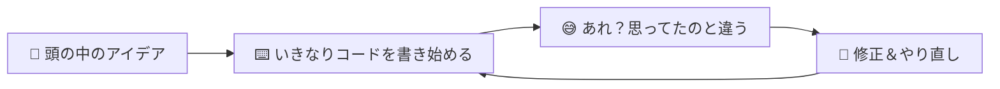
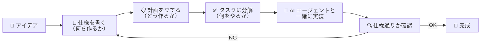
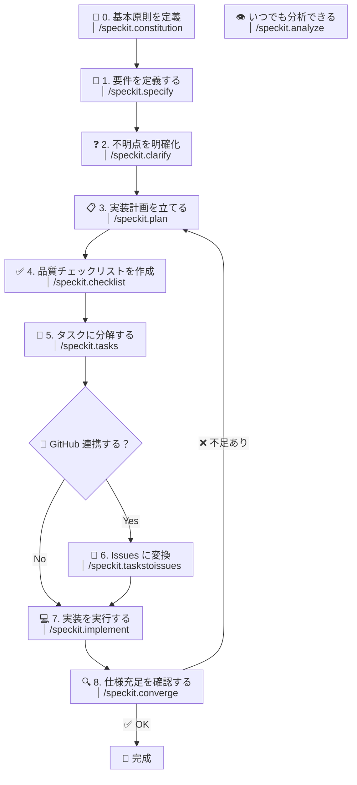
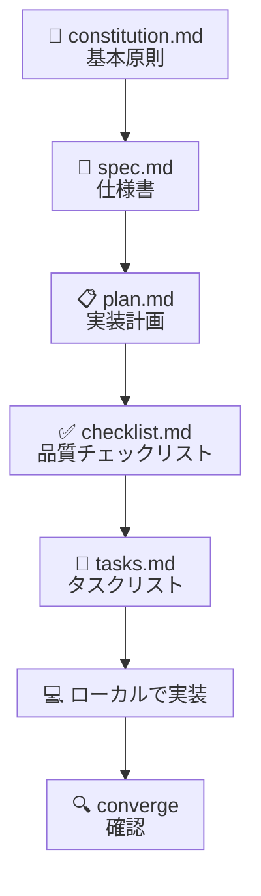
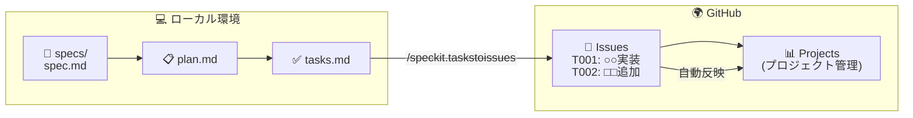
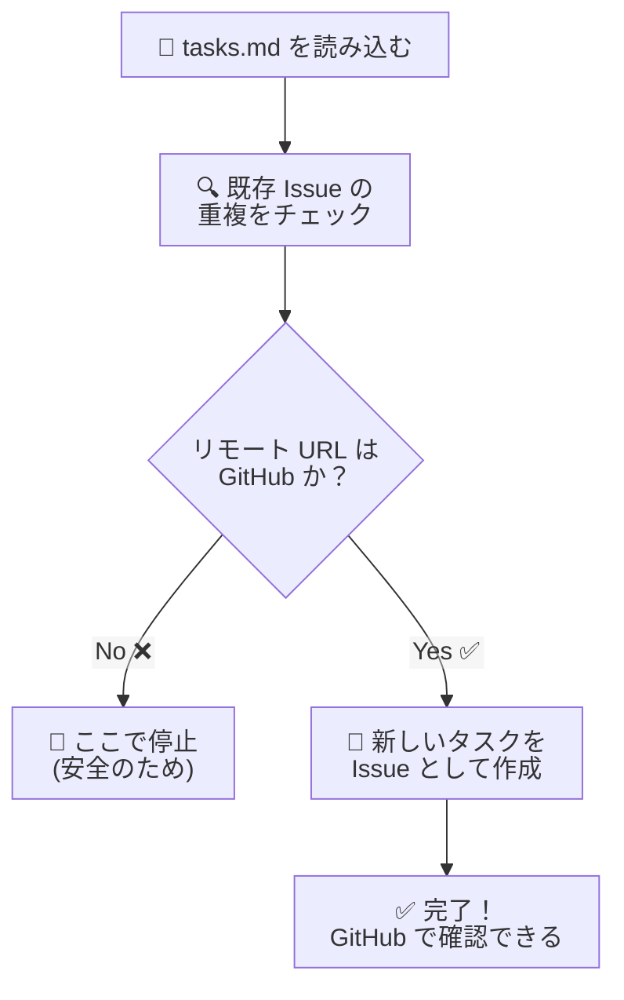

# spec-kit で仕様をコードに変える — ローカル開発と GitHub プロジェクト管理をつなぐ

## この記事を読んでほしい人

- 「仕様書って、結局ちゃんと書いたほうがいいのはわかってるけど…」と思っている人
- 「GitHub Issues ってプロジェクト管理に便利って聞くけど、どう使えばいいの？」と感じている人
- 「ローカルで書いたメモや設計書を、そのまま GitHub のタスク管理に連携できたらいいのに」と思ったことがある人
- AI コーディングエージェントと一緒に、もっと構造的に開発を進めたい人

---

## 目次

- [最初に：開発現場の「あるある」](#最初に開発現場のあるある)
- [spec-kit って何？](#spec-kit-って何)
- [specify-cli って何？](#specify-cli-って何)
- [spec-kit の全体像：仕様から実装までの流れ](#spec-kit-の全体像仕様から実装までの流れ)
- [ローカルで完結する使い方](#ローカルで完結する使い方)
- [GitHub プロジェクト管理との連携](#github-プロジェクト管理との連携)
- [連携の中身をのぞいてみる](#連携の中身をのぞいてみる)
- [/speckit.taskstoissues の処理の流れ](#speckittaskstoissues-の処理の流れ)
- [拡張機能でさらに便利に](#拡張機能でさらに便利に)
- [実際のプロジェクトのファイル構成](#実際のプロジェクトのファイル構成)
- [まとめ](#まとめ)

---

## 最初に：開発の「あるある」

ソフトウェア開発をしていると、こんな経験はありませんか？

- 💭 **「頭の中ではやりたいことが明確なのに、コードを書き始めると迷子になる」**
- 📝 **「仕様書を書いたはいいけど、実装が進むにつれて仕様書とコードが乖離していく」**
- 📋 **「GitHub Issues を手動で一つひとつ作るのが面倒で、つい後回しに」**
- 🤖 **「AI にコードを書いてもらっても、やってほしいことと違うものが返ってくる」**

これらの問題の根本には、**「考えていること」と「実際に動くコード」の間にギャップがある** という共通点があります。

このギャップを埋めるためのアプローチとして、**Spec-Driven Development（仕様駆動開発）** という考え方があります。そしてそれを現実のものにするツールが、**GitHub が公開する spec-kit（スペックキット）** です。

---

## spec-kit って何？

**spec-kit** は、GitHub が公開している **Spec-Driven Development のためのオープンソースツールキット** です。

「ふつうの開発」と「spec-kit を使った開発」の違いを料理に例えてみましょう。

### ふつうの開発



「作りながら考える」スタイル。頭の中のイメージをいきなりコードに落とそうとするので、どうしても行き違いが発生しやすいです。

### spec-kit を使った開発



**「先に仕様を書き、それをもとに計画・実装・確認を行う」** という流れが決まっています。料理で言えば、**レシピ（仕様）を先に書いてから調理を始める** ようなものです。

---

## specify-cli って何？

**specify-cli** は、spec-kit を操作するための **コマンドラインツール（CLI）** です。

```bash
# インストール
uv tool install specify-cli

# プロジェクトの初期化
specify init . --integration copilot
```

specify-cli には、大きく分けて **2 つの使い方** があります。

| 使い方 | 説明 |
|---|---|
| **エージェント経由のスラッシュコマンド** | VS Code などで AI エージェントに `/speckit.specify` のように指示する |
| **直接実行する CLI コマンド** | ターミナルで `specify check` のように直接コマンドを打つ |

---

## spec-kit の全体像：仕様から実装までの流れ

spec-kit が提供するスラッシュコマンドは **全 10 種類**。次のフロー図ですべてのコマンドの関係性を表しています。



**図の見方**: 四角が各スラッシュコマンド、ひし形が分岐、丸が終了点です。`constitution` はプロジェクトの最初に一度実行するコマンド。`analyze` は矢印を持たない「いつでも使える読み取り専用」のコマンドです。この図のもう一つのポイントは **「GitHub 連携する？」という分岐** です。

spec-kit は **純粋にローカルだけで完結させる使い方もできるし、GitHub のプロジェクト管理機能と連携させることもできる** ようになっています。

---

## ローカルで完結する使い方

まずは、**GitHub に頼らず、自分のパソコンの中だけで完結させる使い方** を見てみましょう。

### spec-kit を始める手順

```bash
# 1. specify-cli をインストール
uv tool install specify-cli

# 2. プロジェクトを初期化（GitHub Copilot と統合）
specify init my-project --integration copilot

# 3. プロジェクトに移動
cd my-project
```

これで、プロジェクトに `.specify/` というフォルダが作られ、spec-kit が使える状態になります。

### ローカルワークフローの流れ



ここで作られるファイルは、すべて **ローカルの Markdown ファイル** です。

| ファイル | 内容 | スラッシュコマンド |
|---|---|---|
| `.specify/memory/constitution.md` | プロジェクトの基本原則・開発ガイドライン | `/speckit.constitution` |
| `specs/001-feature/spec.md` | 「何を」「なぜ」作るのか — 要件とユーザーストーリー | `/speckit.specify` |
| `specs/001-feature/plan.md` | 技術スタック・アーキテクチャを含む実装計画 | `/speckit.plan` |
| `specs/001-feature/checklist.md` | 品質チェックリスト（要件の完全性・明確性を検証） | `/speckit.checklist` |
| `specs/001-feature/tasks.md` | 具体的なタスク一覧（依存関係順に並ぶ） | `/speckit.tasks` |

これらのファイルは **ただの Markdown 文書** です。つまり、特別なツールを必要とせず、メモ帳でも編集できるという手軽さがあります。

### ローカルのみで使うメリット

- **インターネット不要** — オフラインでも仕様を書ける
- **Git で管理できる** — 仕様書の変更履歴を残せる
- **自由に編集できる** — テキストファイルなのでエディターを選ばない
- **気軽に始められる** — GitHub アカウントがあれば十分（アカウントすら不要で始められる）

---

## GitHub プロジェクト管理との連携

ここからが本題です。**ローカルで書いた仕様書が、どのように GitHub のプロジェクト管理とつながるのか** を見ていきましょう。

### 連携の全体像

spec-kit の一番の特徴は、**ローカルの仕様・タスクと、GitHub の Issues / Projects を自動的に同期できる** ことです。



左側が **ローカルで書いた仕様やタスク**、右側が **GitHub 上で管理する Issues や Projects** です。

この **`/speckit.taskstoissues`** というコマンドが、両者をつなぐ架け橋になります。

---

## 連携の中身をのぞいてみる

### 何が起きているのか

`/speckit.taskstoissues` を実行すると、ローカルの `tasks.md` に書かれたタスクが **自動的に GitHub Issues として登録** されます。

例えば、こんな `tasks.md` があるとします：

```markdown
# Tasks

## Phase 1: 基盤構築

- [ ] T001: プロジェクトの初期設定を行う
- [ ] T002: データベースのスキーマを定義する
- [ ] T003: 認証機能のベースを実装する

## Phase 2: コア機能

- [ ] T004: ユーザー登録 API を作成する
- [ ] T005: ログイン機能を実装する
```

これを `/speckit.taskstoissues` で処理すると、GitHub 上に次のような Issues が **自動生成** されます：

| Issue タイトル | 対応するタスク |
|---|---|
| `T001: プロジェクトの初期設定を行う` | tasks.md の T001 |
| `T002: データベースのスキーマを定義する` | tasks.md の T002 |
| `T003: 認証機能のベースを実装する` | tasks.md の T003 |
| `T004: ユーザー登録 API を作成する` | tasks.md の T004 |
| `T005: ログイン機能を実装する` | tasks.md の T005 |

### なぜ Issue に変換するのか？

「ローカルでタスク管理できてるなら、わざわざ GitHub Issues にしなくてもよくない？」と思うかもしれません。

ところが、GitHub Issues に変換することには、**ローカルだけでは得られないメリット** がたくさんあります。

| メリット | 説明 |
|---|---|
| **チームで共有できる** | ローカルのファイルをいちいち共有しなくても、Issue を見れば誰でも状況がわかる |
| **進捗が可視化される** | GitHub Projects のボード上で「未着手・進行中・完了」を一目で把握できる |
| **担当を割り当てられる** | 各 Issue に担当者をアサインして、タスクのオーナーシップを明確にできる |
| **議論の場所になる** | 各 Issue のコメント欄で、そのタスクに関するやり取りを記録できる |
| **PR と関連づけられる** | プルリクエストを作成するときに「Closes #123」と書けば、マージ時に自動で Issue がクローズされる |

**ローカルの `tasks.md` が「設計図」で、GitHub Issues が「現場の作業管理ボード」** というイメージです。設計図をもとに現場に作業 tickets を発行し、進捗を可視化する —— まさに、開発のプロジェクト管理そのものです。

---

## /speckit.taskstoissues の処理の流れ

このコマンドが実際にどのような処理をしているのか、もう少し詳しく見てみましょう。



この処理を見ると、spec-kit が **安全に設計されている** ことがわかります。

- ✅ **重複チェック** — 既に Issue 化されたタスクはスキップされるので、同じ Issue が大量に作られることはありません
- ✅ **リモート URL の確認** — GitHub のリポジトリでない場合は処理が停止するので、間違って別のサービスに Issue を作ってしまう事故を防ぎます
- ✅ **Git 拡張との連携** — Issue 作成前に自動でコミットしてくれる設定も可能です

### 料理で例えると

| ステップ | spec-kit の動作 | 料理で例えると |
|---|---|---|
| 1. 仕様を書く | spec.md | レシピを考える |
| 2. 計画を立てる | plan.md | 使う道具・材料を決める |
| 3. タスクに分解 | tasks.md | 調理手順を書き出す |
| 4. **Issue に変換** | **/speckit.taskstoissues** | **調理指示書を各自に配る** |
| 5. 実装する | /speckit.implement | 実際に調理する |
| 6. 確認する | /speckit.converge | 味見してレシピ通りか確認 |

**「調理指示書を各自に配る」** というステップが、まさに `/speckit.taskstoissues` の役割です。個人で料理をするなら必要ありませんが、**チームで料理をするなら、各自に役割を伝えるための指示書が必要** ですよね。GitHub Issues はその「指示書」の役割を果たします。

---

## 実際のプロジェクトのファイル構成

spec-kit を導入したプロジェクトは、おおむね次のような構成になります。

```
my-project/
├── .specify/                    # spec-kit の設定ファイル群
│   ├── templates/               # コアテンプレート
│   │   └── commands/
│   │       └── taskstoissues.md # Issue 変換のテンプレート
│   ├── extensions/              # インストール済み拡張機能
│   ├── memory/
│   │   └── constitution.md      # プロジェクトの「憲法」（基本ルール）
│   ├── extensions.yml           # フック設定
│   └── feature.json             # 現在のアクティブフィーチャー
├── specs/                       # 仕様書を入れるフォルダ
│   └── 001-feature-name/
│       ├── spec.md              # 仕様書（何を・なぜ作るか）
│       ├── plan.md              # 実装計画（どう作るか）
│       ├── tasks.md             # タスクリスト（何をやるか）
│       └── contracts/           # API の契約書
└── src/                         # 実際のコード
    └── ...
```

この構成で重要なのは、**仕様・計画・タスクがすべてローカルのテキストファイルとして管理されている** という点です。これらは Git でバージョン管理できるので、「あの時、なぜこの仕様にしたんだっけ？」という履歴もたどれます。

---

## まとめ

spec-kit が提供する、「ローカルでの仕様管理」と「GitHub でのプロジェクト管理」の関係をおさらいしましょう。

### ローカルと GitHub の役割分担

| | 💻 ローカル（specs/ の中） | 🌍 GitHub（Issues / Projects） |
|---|---|---|
| **役割** | 仕樣の設計・計画 | 作業の管理・進捗の可視化 |
| **向いてること** | 詳細な記述、設計の検討 | チームでの共有、タスクの割り当て |
| **更新する人** | 主に設計者・開発者 | チームメンバー全員 |
| **形式** | Markdown（自由形式） | Issue（構造化された形式） |

### この記事のポイント

- ✅ **spec-kit** は仕様駆動開発（Spec-Driven Development）のための **全 10 コマンド** を備えたツールキット
- ✅ **specify-cli** はその CLI ツールで、`uv tool install specify-cli` でインストールできる
- ✅ ローカルでは **Markdown ファイル** で仕様・計画・タスクを管理する
- ✅ spec-kit の **10 のスラッシュコマンド**：
  - 📜 **constitution** — プロジェクトの基本原則を定義
  - 📝 **specify** — 要件・ユーザーストーリーを定義
  - ❓ **clarify** — 不確定な箇所を明確化
  - 📋 **plan** — 技術スタックを含む実装計画を作成
  - ✅ **checklist** — 品質チェックリストを生成
  - 📌 **tasks** — 依存関係順にタスクに分解
  - 📡 **taskstoissues** — タスクを GitHub Issues に変換
  - 💻 **implement** — タスクを順次実行して実装
  - 🔍 **converge** — コードが仕様を満たしているか評価
  - 👁️ **analyze** — spec/plan/tasks 間の一貫性を分析（読み取り専用）
- ✅ **`/speckit.taskstoissues`** コマンドで、ローカルのタスクを GitHub Issues に変換できる
- ✅ GitHub Issues は **GitHub Projects** と連携して、チーム全体の進捗管理に使える
- ✅ 重複チェックやリモート URL の確認など、**安全に設計されている**
- ✅ 拡張機能（コミュニティ製）を使えば、Issue と spec の双方向同期や実装完了の自動反映も実現できる ※詳しくは別記事で解説予定

### どんなときに spec-kit が役立つか

- **ひとり開発**: 自分の考えを整理しながら、計画的にコードを書きたい
- **チーム開発**: 仕様の共有とタスクの割り当てをスムーズに行いたい
- **AI エージェントと協業**: AI に「何を作るか」を明確に伝えて、意図通りのコードを生成してもらいたい

spec-kit は、**「頭の中のアイデア」** と **「実際のコード」** の間にあるギャップを埋めるための、とても実用的なツールです。

まずは `uv tool install specify-cli` でインストールして、お試しで小さな機能の仕様を書いてみるところから始めてみてください。その仕様がやがて GitHub Issues に変換され、プロジェクトボードに並ぶ様子を想像すると、ワクワクしませんか？ 😊
